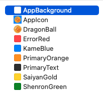

# 📝 Requirements
* 	Implements the Clean Architecture, and **MVVM** design pattern in the Presentation layer
* 	Uses **SwiftData** for persisting heros, transformations and locations
* 	UI built with **XIBs** and **UIKit**
* 	Unit **tests** for services, persistence, use cases and view models
* 	Consumes the Dragon Ball **REST API**

# 🐾 User Stories

### Login
* Handle user input validation and errors
* Securely store the JWT using Keychain
* On app launch, check if the user is already authenticated

### Heros
* Check if local data is available; if not, fetch from the API
* Persist fetched data for offline access

### Hero Detail
* Display a map with hero-related locations, focusing on one
* Show hero’s name, description, and transformations (if applicable)

### Transformation Detail
* Display transformation’s image, name, and description

### Logout
* Provide a logout button in the home screen
* Clear the local database when the user logs out

### Appearance
* Support for Light and Dark Mode

# 😮‍💨 Optional 
* Display the user’s current location on the map
* Allow users to select the map type
* Show detailed location information on the map
* Implement a search feature for heroes
* Enable sorting options for the hero list

# 🏞️ Style
As part of support for Light and Dark mode, I created some assets for both Any appearance and dark:
 | 

# 🧽 Clean Architecture

Here the squence diagram for the project:

# 🍻 Cheers to doing testing!

This time, I took the time to write a unit test after each piece of code I created, instead of leaving it for the end. After writing the API client, because I started for the Infraestructure layer, I found an error while running the test that was expected to succeed:

Basically, I was validating if there was an error for a successful response, this really helped me save time and anticipate the error when I started making requests:

In general, I used OSLog to monitor the behavior of each event and created mock and stubs data to test every API session, use case, and view model:

In summary, initiating the project by building from the outline layers proved to be more efficient in my experience, as relying on the UI often slows down the process due to the iOS simulator's load time. I now feel confident that when it's time to implement the UI, all components will integrate seamlessly.

# 👨🏻‍🏫 Thanks
I'm grateful to my teacher Pedro Muñoz. His classes were a great experience, and I learned a practical approach to implementation—writing code based on real needs from the start.